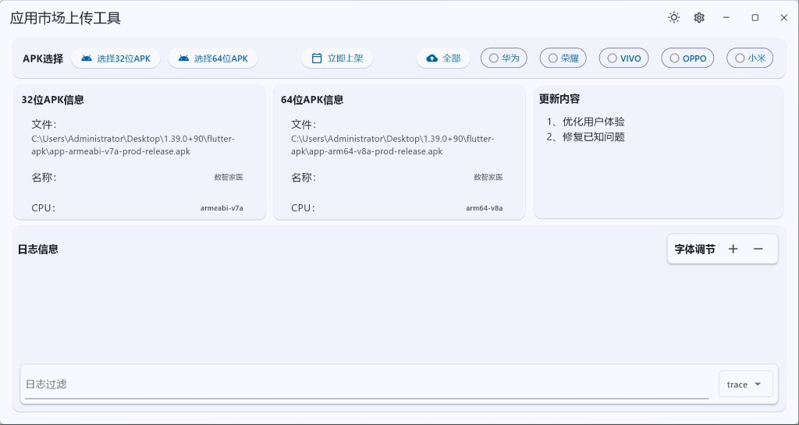
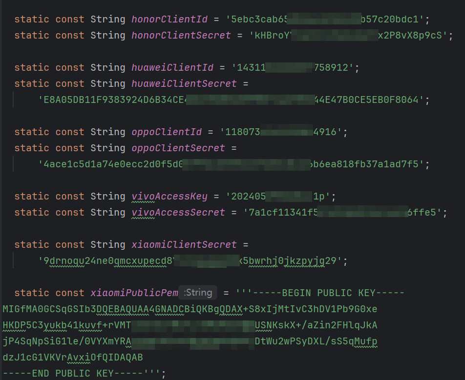

# 应用市场上传工具 - Flutter

一款高效的应用市场上传工具，支持将APK文件（32位、64位）双包上传到主流应用市场，并提供便捷的更新文案配置和上架时间管理功能。

## 功能特点

- **多市场支持**：支持华为、荣耀、VIVO、OPPO、小米应用市场，后续其他应用市场开发传包API可增加
- **双包上传**：支持32位和64位APK文件的同时上传（支持双包的应用市场：OPPO、VIVO、小米）
- **更新管理**：支持配置更新文案、版本说明等信息
- **定时上架**：可灵活设置应用上架时间
- **批量处理**：支持多个应用市场的批量上传操作
- **界面友好**：简洁直观的操作界面，提供清晰的上传进度和状态显示

## 使用说明

### 环境配置

解析APK文件需要用到Android SDK目录。配置优先级从高到低依次为：

1. **手动配置**：
   - 点击界面右上角设置按钮
   - 选择或输入Android SDK目录
   - 点击保存按钮

2. **系统环境变量**：
   - 系统会自动从环境变量`ANDROID_SDK_ROOT`或`ANDROID_HOME`获取Android SDK目录

3. **默认配置**：
   - Windows默认目录：`C:/Users/Administrator/AppData/Local/Android/Sdk`
   - MacOS默认目录：`/Users/cechds/Library/Android/sdk`

### 操作流程

1. 选择APK文件（32位和64位）
2. 设置上架时间（可选）
3. 配置更新文案和版本说明
4. 点击选择目标应用市场即可上传（也可以直接点击全部按钮）

### 注意事项
- 根据Flutter官方文档安装对应的Visual Studio（Windows）、XCode（MacOS）等开发工具
- 根据各应用市场官方文档申请应用市场账号和密钥，并配置到应用市场上传工具中（小米需把证书通过命令转换成PublicPem字符串）

## 技术架构

### 主要依赖

- **网络请求**：使用`dio`包处理HTTP请求
- **文件处理**：使用`file_picker`进行文件选择，`parser_apk_info`解析APK信息
- **数据加密**：使用`crypto`和`pointycastle`进行哈希和RSA加密
- **数据存储**：使用`shared_preferences`进行配置信息持久化
- **界面主题**：使用`adaptive_theme`支持主题切换
- **窗口管理**：使用`window_manager`进行窗口控制

## 开发环境

- Flutter 3.29.2
- Dart SDK 3.7.2
- 测试支持平台：Windows、MacOS

## 运行环境要求

- 操作系统：Windows 10/11、MacOS 10.15+
- 必需组件：Android SDK

## 界面预览

*图1：应用主界面，展示了文件选择、市场选择和上传配置等功能区域*

## 配置示意图

*图2：各应用市场参数，已打码，仅展示长度*
